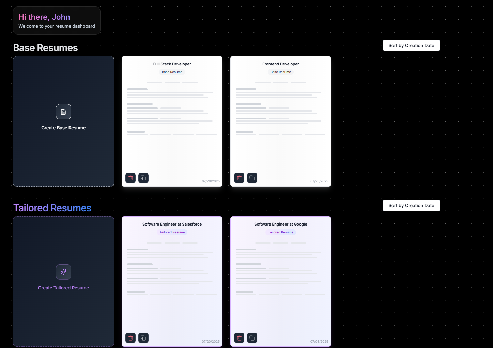
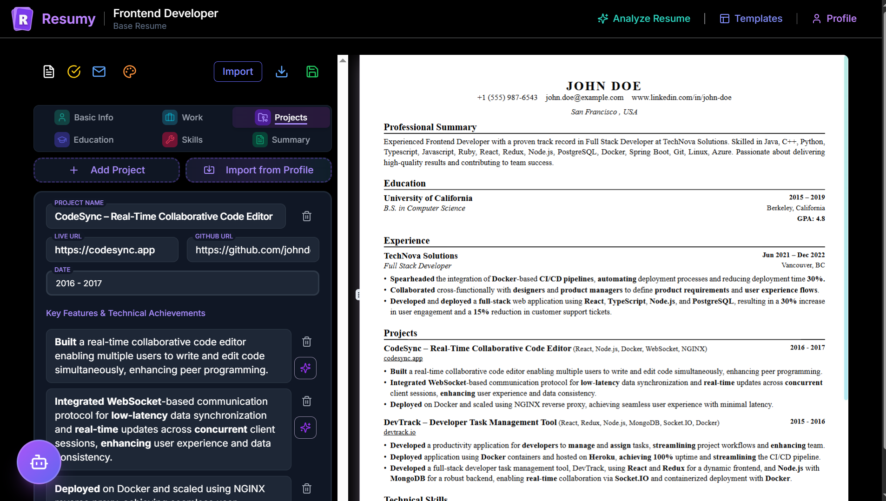
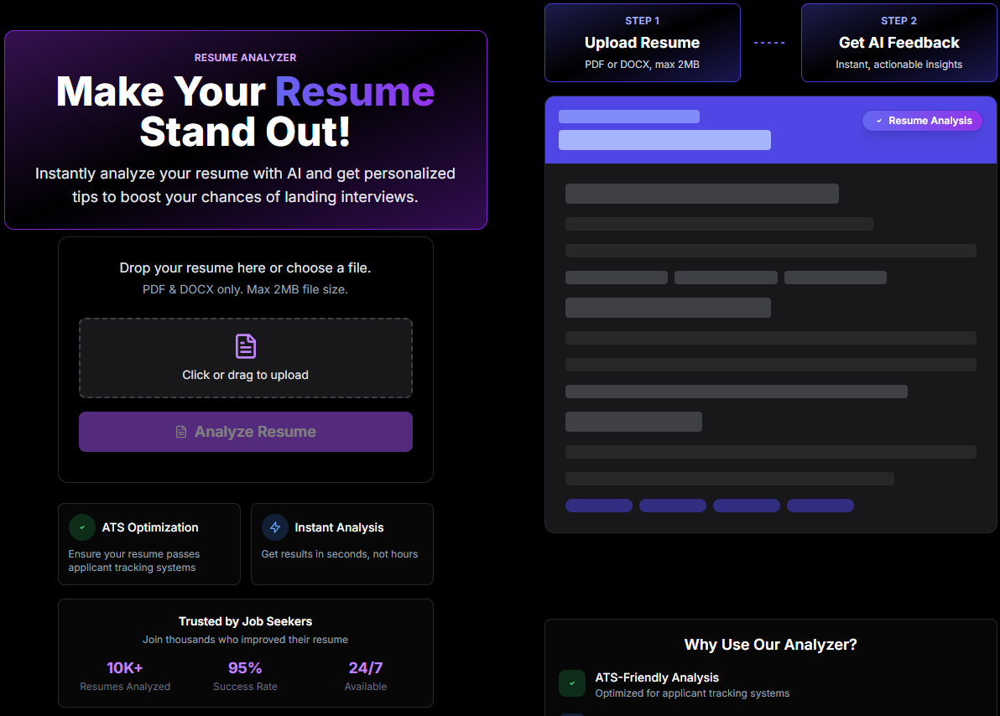
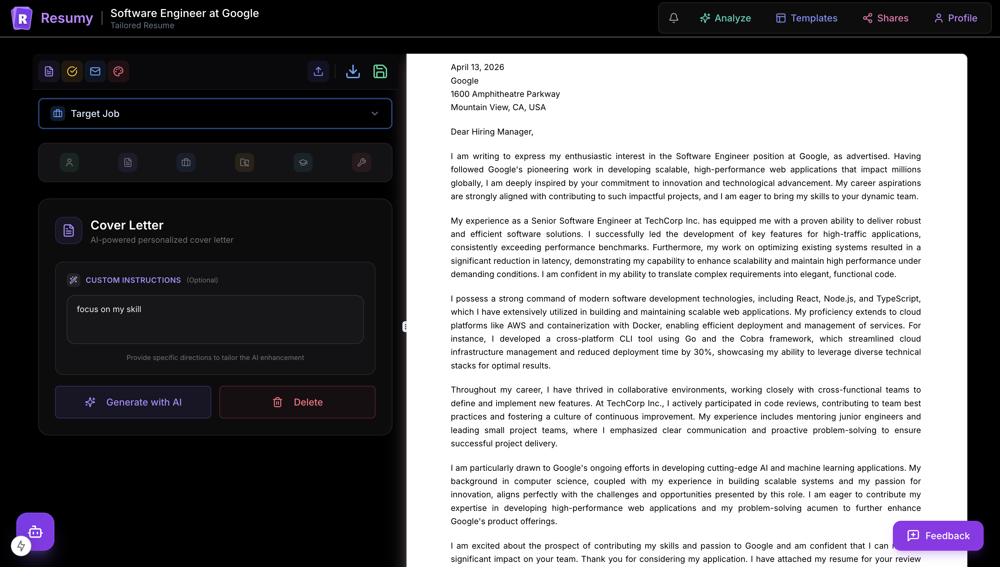
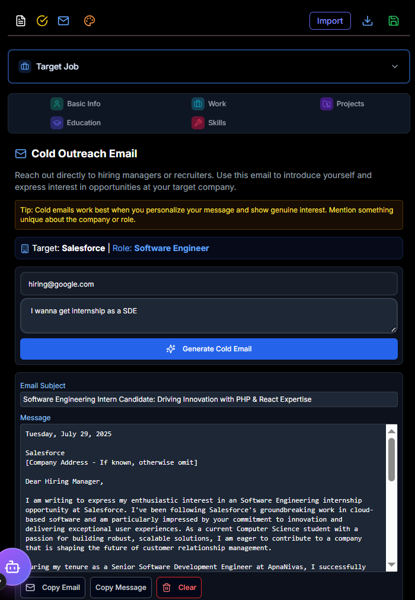
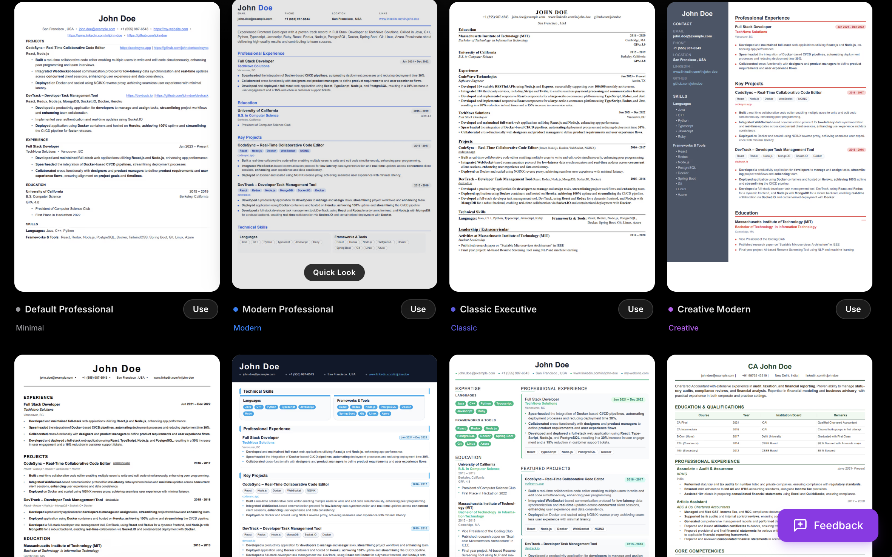
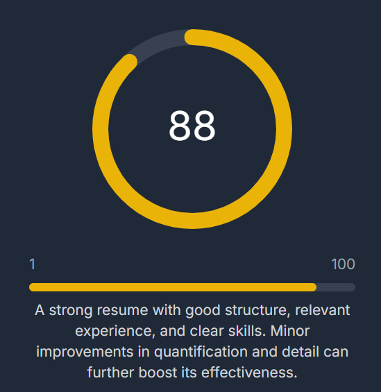
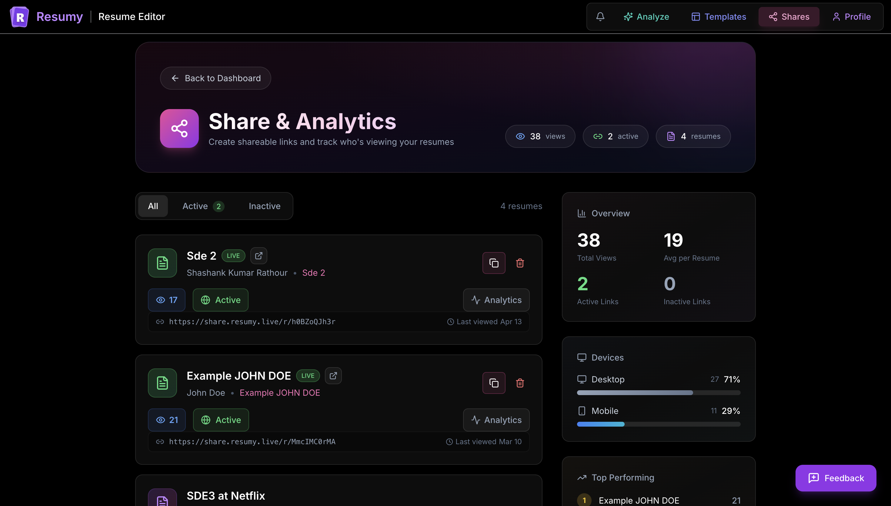

<div align="center">
  
  <h1>Resumy</h1>
  <p><strong>AI-powered resume builder for ATS-ready resumes, tailored applications, cover letters, and outreach workflows.</strong></p>

  <p>
    <a href="https://resumy.live">Live Demo</a>
  </p>

  <p>
    
    
    
    
    
    
  </p>
</div>

Resumy helps job seekers build strong resumes from a single workspace: create base resumes, generate tailored versions for specific roles, analyze ATS readiness, improve content with AI, create cover letters and cold emails, and share resumes with analytics.

## Ecosystem Repositories

- Main application (Resumy): https://github.com/Happyesss/resumy
- Public sharing service (Resumy Share): https://github.com/Happyesss/resumy-share

## Product Preview



## Feature Gallery

| Dashboard | Resume Editor |
| --- | --- |
|  |  |
| Manage base and tailored resumes in one workspace. | Edit content with live preview and autosave. |

| ATS Analysis | AI Assistant |
| --- | --- |
|  |  |
| Analyze resume quality, role fit, and keyword gaps. | Improve sections with an in-editor AI assistant. |

| Cover Letter | Cold Email |
| --- | --- |
|  |  |
| Generate and edit cover letters with synchronized data. | Draft personalized outreach emails quickly. |

| Templates | ATS Result Snapshot |
| --- | --- |
|  |  |
| Switch between multiple professional template styles. | Review score output and optimization feedback. |

## Resumy Share Service

Resumy Share is the public link delivery layer for resumes created in the main app. It runs as a dedicated service and powers all public resume URLs.

Primary URL pattern:

- https://share.resumy.live/r/{share_id}

How it is connected to the main app:

1. In the Resumy dashboard, users create or manage share links for a resume.
2. The main app saves share configuration in Supabase (`resume_shares`) and generates the public URL using `NEXT_PUBLIC_SHARE_URL`.
3. Resumy Share resolves `share_id` or custom slug, validates active/expiry status, and renders the resume page.
4. On each valid visit, Resumy Share sends analytics events to `share_view_analytics` and increments view totals.
5. The main app reads those analytics so users can monitor audience activity from the dashboard.

Cool features in Resumy Share:

- Public resume links with active/expiry controls and optional indexing behavior.
- Live view tracking and aggregate counters for each shared link.
- Device, browser, OS, country, and referrer analytics capture.
- Privacy-conscious session tracking with dedupe windows to reduce inflated counts.
- In-view actions: copy link, download PDF, and zoom controls (including touch/trackpad pinch).



> This repository includes README, CONTRIBUTING.md, and CODE_OF_CONDUCT.md so GitHub shows the standard top tabs for README, Contributing, and Code of conduct.

## Complete Feature Set

- Resume workspace: base and tailored resume flows with organized dashboard views.
- Rich editor: sections for profile, summary, work experience, projects, education, and skills.
- Live preview: side-by-side editor and preview with quick PDF download support.
- AI assistant: contextual suggestions and edits for resume sections.
- ATS analysis: scoring, keyword analysis, and detailed improvement recommendations.
- Cover letters: rich-text editing and PDF export support.
- Cold email generation: AI-assisted outreach drafts for applications and networking.
- Template system: modern, classic, creative, minimal, and professional variants.
- Resume sharing: public share links with view tracking and controls.
- View analytics: logs and aggregate visibility insights for shared resumes.
- Notifications: browser push notifications for relevant share activity.
- Feedback system: submit bug reports, feature requests, and general feedback.
- Authentication and profiles: Supabase Auth with profile management.
- Security model: Supabase Row Level Security policies across user data.
- API architecture: Next.js API routes and server actions for feature workflows.

## Tech Stack

| Layer | Technologies |
| --- | --- |
| Frontend | Next.js 15 App Router, React 19, TypeScript |
| UI System | Tailwind CSS, Radix UI, shadcn-style components, Framer Motion |
| Rich Text and Editing | TipTap editor ecosystem |
| AI Runtime | Vercel AI SDK (`ai`) |
| AI Providers | Google Gemini, OpenAI, Anthropic, Groq, DeepSeek, xAI |
| Data and Auth | Supabase (Postgres, Auth, RLS) |
| Realtime and Limits | Upstash Redis, custom rate limiting and daily usage controls |
| Document Generation | @react-pdf/renderer, html2canvas/html2pdf tooling |
| Validation and Types | Zod schemas, TypeScript types |
| Tooling | ESLint, TypeScript compiler, pnpm |

## Project Structure

```text
src/
  app/                 # Routes, layouts, and API endpoints
  components/          # Feature and UI components
  hooks/               # Custom React hooks
  lib/                 # Core config, constants, schemas, utilities
  types/               # Shared TypeScript definitions
  utils/               # Actions, auth helpers, Supabase clients
public/                # Images, templates, icons, and static assets
schema.sql             # Database schema, triggers, and RLS policies
```

## Quick Start

### 1. Prerequisites

- Node.js 20+
- pnpm (recommended) or npm/yarn
- Supabase project
- At least one AI provider key for AI features

### 2. Install

```bash
git clone https://github.com/Happyesss/resumyy.git
cd resumyy
pnpm install
```

### 3. Configure Environment

```bash
cp .env.example .env.local
```

Required variables:

```env
NEXT_PUBLIC_SUPABASE_URL="https://your-supabase-project.supabase.co"
NEXT_PUBLIC_SUPABASE_ANON_KEY="your-supabase-anon-key"
SUPABASE_SERVICE_ROLE_KEY="your-supabase-service-role-key"
GEMINI_API_KEY="your-gemini-api-key"
NEXT_PUBLIC_SITE_URL="http://localhost:3000"
```

Optional variables:

```env
UPSTASH_REDIS_REST_URL="https://your-redis-instance.upstash.io"
UPSTASH_REDIS_REST_TOKEN="your-upstash-redis-token"
NEXT_PUBLIC_SHARE_URL="http://localhost:3001"
NEXT_PUBLIC_VAPID_PUBLIC_KEY="your-vapid-public-key"
VAPID_PRIVATE_KEY="your-vapid-private-key"
ENABLE_MIGRATION_ROUTE="false"
MIGRATION_ROUTE_TOKEN="set-a-long-random-secret"
```

### 4. Set Up Database

Run [schema.sql](schema.sql) in Supabase SQL Editor.

### 5. Run the App

```bash
pnpm dev
```

Open http://localhost:3000.

## Development Commands

```bash
pnpm dev         # Start development server (Turbopack)
pnpm build       # Create production build
pnpm build:cf    # Build for Cloudflare (OpenNext)
pnpm preview:cf  # Preview Cloudflare worker locally
pnpm deploy:cf   # Build and deploy to Cloudflare
pnpm cf-typegen  # Generate Cloudflare env types
pnpm start       # Start production server
pnpm lint        # Run lint checks
pnpm lint:fix    # Auto-fix lint issues
pnpm type-check  # Run TypeScript checks
```

## Cloudflare Deployment

This app includes first-class Cloudflare deployment wiring using OpenNext.

- Worker entry: `.open-next/worker.js`
- Static assets: `.open-next/assets`
- Config files: `wrangler.toml`, `open-next.config.ts`

See [DEPLOYMENT.md](DEPLOYMENT.md) for full deploy instructions.

## Documentation

- [SETUP_GUIDE.md](SETUP_GUIDE.md)
- [DEPLOYMENT.md](DEPLOYMENT.md)
- [CONTRIBUTING.md](CONTRIBUTING.md)
- [CODE_OF_CONDUCT.md](CODE_OF_CONDUCT.md)

## Contributing

Please read [CONTRIBUTING.md](CONTRIBUTING.md) before opening a pull request.

Important policy: all contributions must flow through the dev branch.

## License

Licensed under Apache License 2.0. See [LICENSE](LICENSE).
