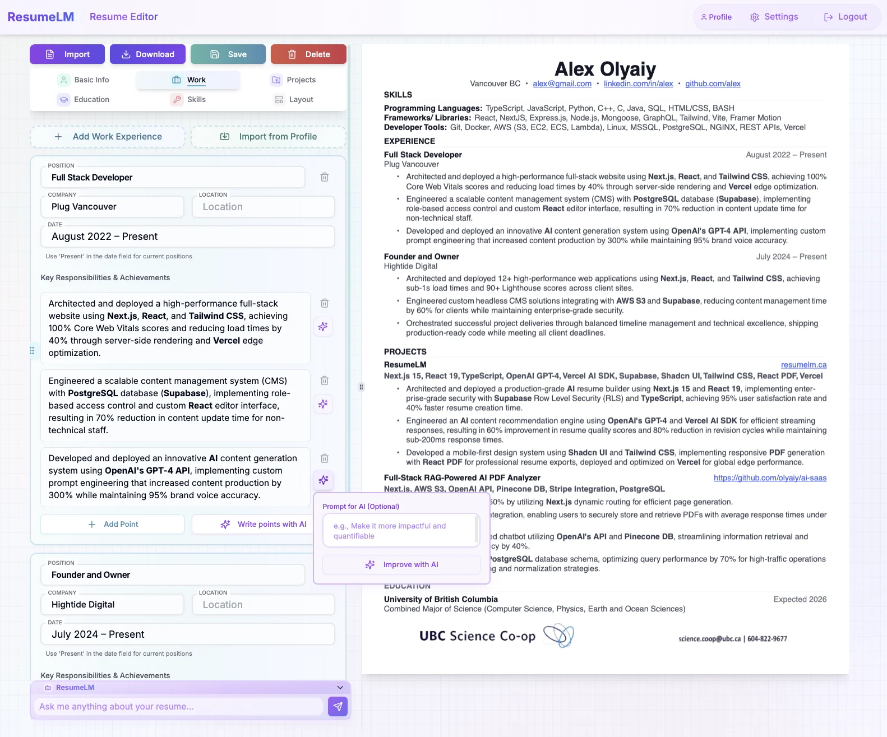
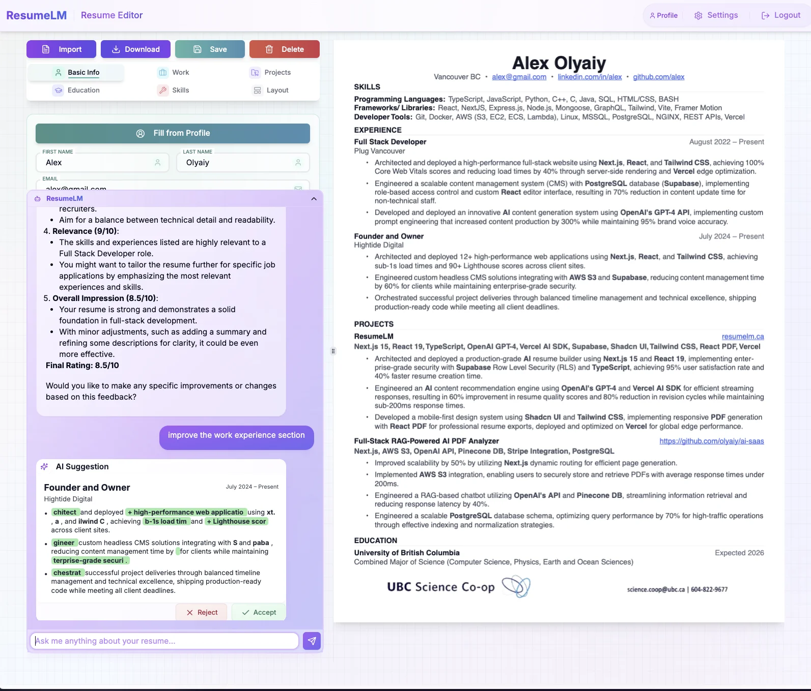
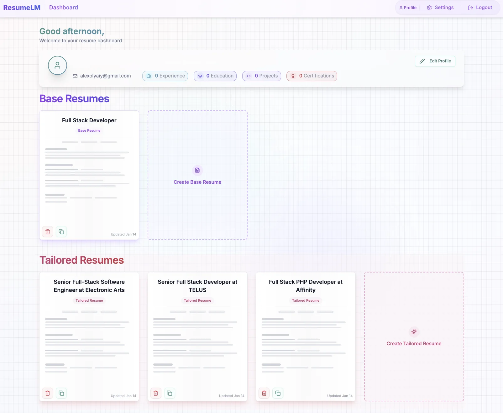

# Resumy - Free AI-Powered Resume Builder

Try it out at [resumy.live](https://resumy.live)!

> � **Production Ready & SEO Optimized**

A completely free, open-source AI resume builder that helps create professional, ATS-optimized resumes for any job application. Simply provide your Gemini API key to unlock powerful AI features. Built with Next.js 15, React 19, TypeScript, and Shadcn UI.



## ✨ Live Demo

Check out the live demo at [resumy.live](https://resumy.live)

## 🌟 Key Features

### Resume Management
- 📝 Two-tier resume system:
  - **Base Resumes**: Foundation templates for your professional profile
  - **Tailored Resumes**: AI-optimized versions for specific job applications
- 💼 Comprehensive section management for:
  - Work Experience
  - Education
  - Projects
  - Skills
- 📊 Resume scoring system to measure ATS effectiveness
- 🗂️ Resume sorting and organization
- 📱 Mobile-first approach with responsive layouts
- 🎨 Modern, professional design optimized for ATS systems



### AI Integration
- 🤖 AI-powered content suggestions for all resume sections
- 💡 Smart content optimization and improvement recommendations
- 🎯 Intelligent job description analysis
- 💬 Interactive AI assistant for resume writing guidance
- ✨ Real-time content enhancement suggestions
- 🔄 Multiple AI model support (OpenAI, Claude, Gemini, DeepSeek, Groq)



### Cover Letter Generation
- 📝 Integrated cover letter editor
- 🤖 AI-assisted cover letter creation
- 🔄 Synchronized with resume data
- 📁 Export capabilities

### Profile Management
- 👤 User profile creation and management
- 🎓 Education history tracking
- 💼 Work experience management
- 🛠️ Skills inventory
- 🚀 Projects showcase

### Technical Features
- 🔒 Row Level Security (RLS) for data protection
- 🚀 Server-side rendering with Next.js 15 App Router
- 📄 PDF generation and preview
- 🎨 Custom design system with consistent UI/UX
- 🔄 Real-time updates and preview

### Free & Open Source
- 🆓 **Completely Free**: No subscriptions, no payments, no limitations
- 🔑 **Gemini API Powered**: Simply provide your Google Gemini API key for AI features
- 📱 **Unlimited Usage**: Create unlimited base and tailored resumes
- 🌟 **All Features Included**: Access to every feature without restrictions

## 🎨 Design System

### Core Principles
- **Layered Depth**: Multiple translucent layers create visual hierarchy
- **Organic Motion**: Subtle animations suggest liveliness without distraction
- **Purposeful White Space**: Generous spacing improves content digestion
- **Consistent Interaction**: Predictable hover and active states

## 🛠️ Tech Stack

### Frontend
- Next.js 15 (App Router)
- React 19
- TypeScript
- Shadcn UI Components
- Tailwind CSS
- React PDF

### AI & Data Processing
- OpenAI Integration
- Server Components for AI Processing
- Structured JSON Data Format

### Database
- PostgreSQL with Row Level Security
- Prisma ORM
- Supabase Auth

## 🚀 Getting Started

1. Clone the repository:
```bash
git clone https://github.com/olyaiy/resume-lm.git
```

2. Install dependencies:
```bash
npm install
# or
pnpm install
```

3. Set up your environment variables:
```bash
cp .env.example .env.local
```

Required environment variables: Look in the `.env.example` file for the full list of required variables.

4. Set up the database:

This application uses Supabase for authentication and database features. You need to create a Supabase project and set up the required tables.

**Option 1: Using the SQL Editor in Supabase Dashboard**
   - Copy the contents of `schema.sql` from this repository
   - Open your Supabase project dashboard
   - Go to SQL Editor
   - Paste and run the SQL script

**Option 2: Using the Supabase CLI**
   - Install the Supabase CLI
   - Run the following command:
   ```bash
   supabase db push --db-url=your_supabase_db_url schema.sql
   ```

5. Start the development server:
```bash
npm run dev
# or
pnpm dev
```

Open [http://localhost:3000](http://localhost:3000) to view the application.

### Database Schema

This application requires several tables in your Supabase database:

- **profiles**: Stores user profile information including work experience, education, and skills
- **resumes**: Stores user-created resumes and their content
- **jobs**: Tracks job descriptions for resume tailoring

The complete schema with all required fields is provided in the `schema.sql` file.

## 🏗️ Project Status

### Production Ready Features
- ✅ Complete resume management system
- ✅ AI-powered content generation and optimization
- ✅ PDF export functionality
- ✅ Responsive design system
- ✅ User authentication and authorization
- ✅ Profile management
- ✅ Real-time preview and editing

### Upcoming Features
- 🔄 Enhanced AI tailoring algorithms
- 🔄 Additional resume templates
- 🔄 Advanced PDF customization
- 🔄 Job application tracking
- 🔄 Analytics dashboard

## 📝 Contributing

We welcome contributions! Please see our [Contributing Guide](CONTRIBUTING.md) for details.

## 📄 License

[GNU Affero General Public License v3 (AGPL-3.0)](LICENSE)

This project is licensed under the GNU AGPL v3 license. This means:
- ✅ You can view, use, and modify the code
- ✅ You can distribute the code
- ✅ You must keep the source code open source
- ✅ Any modifications must also be under AGPL-3.0
- ❌ You cannot use this code in closed-source commercial applications
- ❌ You cannot use this code to provide a similar service without making your code open source

For more details, see the [full license text](LICENSE).

---

Built with ❤️ using [Next.js](https://nextjs.org/)
